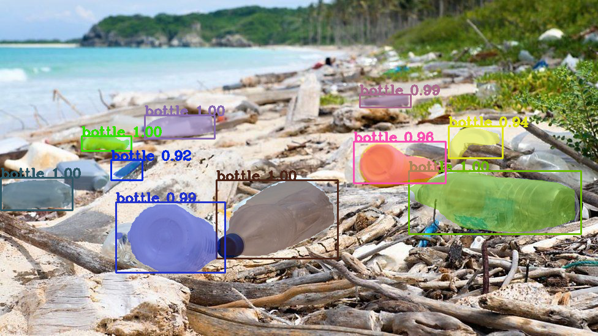

# Mask R-CNN for Bottle Object Detection and Segmentation

This is an implementation of [Mask R-CNN](https://arxiv.org/abs/1703.06870) on Python 3, Keras, and TensorFlow. The model generates bounding boxes and segmentation masks for each instance of bottle in the image. It's based on Feature Pyramid Network (FPN) and a ResNet101 backbone. Code customised and coco weights adapted from Matterport, Mask R-CNN-{\url{https://github.com/matterport/Mask_RCNN}} for bottle segmentation training.

The repository includes:
* Source code of Mask R-CNN built on FPN and ResNet101.
* Training code 
* Pre-trained weights for Bottle custom dataset
* Jupyter notebooks to visualize the detection pipeline at every step
* Evaluation as per MSCOCO metrics (AP)


* ([model.py](mrcnn/model.py), [utils.py](mrcnn/utils.py), [config.py](mrcnn/config.py)): These files contain the main Mask RCNN implementation. 

* bottle/inspect_bottle_data.ipynb  This notebook visualizes the different pre-processing steps to prepare the training data.
* bottle/inspect_bottle_model_check.ipynb  This notebook goes in depth into the steps performed to detect and segment objects. It provides visualizations of every step of the pipeline.
* bottle/inspect_bottle_weights.ipynb  This notebooks inspects the weights of a trained model and looks for anomalies and odd patterns.
* bottle/model-videosegmentation.ipynb    This notebook contains video segmentation.
* bottle/Eval_model.ipynb     This notebook contains model evaluation and image segmentation 
* bottle/bottle.py contains the code for training and segmentation.


## Step by Step Detection

    ## 1. Anchor sorting and filtering
    ## 2. Bounding Box Refinement
    ## 3. Mask Generation
    ## 4. Layer activations
    ## 5. Weight Histograms
    ## 6. Composing the different pieces into a final result

# Training
Pre-trained weights for Bottle custom dataset added to the repository for using as a base weight for extension of this work as per individual requirement to create variations on the network. Jupyter Notebook python codes can be used for training and detection.

## Train the bottle model

The code in `bottle.py` is set to train for 1000K steps (1 epochs of 1000 steps each), and using a batch size of 1.

    # Train a new model starting from pre-trained COCO weights 
    python bottle/bottle.py train --dataset=/path/to/bottle/dataset --weights=coco

    # Resume training a model that you had trained earlier
    python bottle.py train --dataset=/path/to/bottle/dataset --weights=last

    # Train a new model starting from ImageNet weights
    python bottle.py train --dataset=/path/to/bottle/dataset --weights=imagenet
    
    # Train a new model starting from pre-trained bottle weights
    python bottle/bottle.py train --dataset=/path/to/bottle/dataset --weights=<path to weight>
    
   eg;
     #  python bottle/bottle.py train --weights=logs/mask_rcnn_bottle_0100.h5 --dataset=dataset --layer='4+' --aug='Fliprl'
    
    Model Training optional Parameter:
    =================================
    --layer = "'heads' or '4+' or '3+' or 'all' "
    --epoch = " Enter no of epoch for training " default value set as '1'        
    --aug = "'Fliplr' or 'Flipud'" default set to None


## Segmentation 

    # Apply color segmentation to bottles for a particular image file
    python bottle/bottle.py segment --weights=/path/to/weights/file.h5 --image=<URL or path to file>
 

    # Apply color segmentation to bottles for all images in a folder
    python bottle.py segment --weights=/path/to/weights/file.h5 --imagefolder=<path to folder>
        

    # Apply color segmentation to bottles video using the last weights you trained
    python bottle.py segment --weights=last --video=<URL or path to file>


    --image = Image file path to apply the color segmentation
    --imagefolder = Images folder name to apply the color segmentation
    --video = Video file path to apply the color segmentation
    
   eg;
     #  python bottle/bottle.py segment --weights=logs/mask_rcnn_bottle_0100.h5 --imagefolder=images                                                          

## Requirements
Python 3.7, TensorFlow-gpu 1.5, Keras 2.2.4 and other common packages listed in `requirements.txt` for linux Installation

## Installation 
:1. Clone this repository
2. Install dependencies
   ```bash
   pip install -r requirements.txt
   ```
3. Run setup from the repository root directory
    ```bash
    python setup.py install
    ``` 
3. To download pre-trained bottle weights (mask_rcnn_bottle_0100.h5) for segmentation from logs folder use git lfs pull as it git clone doesn't download lfs file completely.

4. Run training or segmentation task from terminal.  


### MS COCO Requirements 
To train or test on MS COCO, you'll also need:
* pycocotools 
* [MS COCO Dataset](http://cocodataset.org/#home)
* Download the 5K [minival](https://dl.dropboxusercontent.com/s/o43o90bna78omob/instances_minival2014.json.zip?dl=0)
  and the 35K [validation-minus-minival](https://dl.dropboxusercontent.com/s/s3tw5zcg7395368/instances_valminusminival2014.json.zip?dl=0)
  subsets. More details in the original [Faster R-CNN implementation](https://github.com/rbgirshick/py-faster-rcnn/blob/master/data/README.md).
  
### Image and video segmentation 
 


